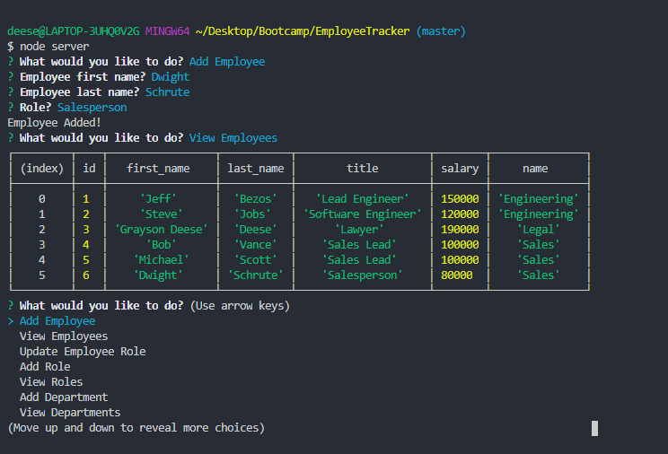

# Employee Tracker
A CLI application that allows users to manage employees.
## Table of Contents
***
  * [Employee Tracker](#employee-tracker)
  * [Installation](#installation)
  * [Usage](#Usage)
  * [Technologies](#technologies)
  * [Screenshot](#screenshot)
***

## Installation
***
To install necessary dependencies, run the following command:

```
npm i
```
***

## Usage
***
To start the application run:
```
node server
```
***

## Technologies
***
<b>Built with</b>
- [Javascript](https://developer.mozilla.org/en-US/docs/Web/JavaScript)
- [NodeJs](https://nodejs.org/en/docs/)
- [MySQL](https://www.mysql.com/)
- [Inquirer](https://www.npmjs.com/package/inquirer)
***

## Screenshot
***

***
